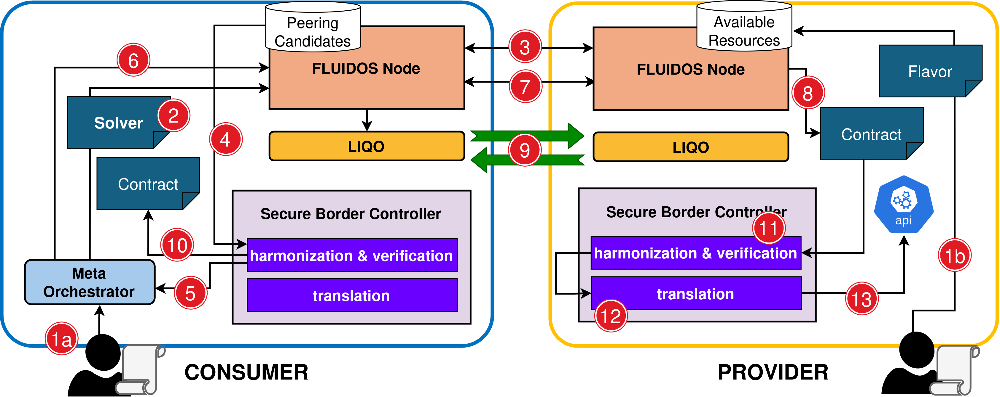

# Secure Border Controller - Architecture & Workflow

## FLUIDOS Architecture: Context & Interactions

A **consumer** node intends to offload certain services (workloads) to a **provider** node, by renting some of its resources. Upon service offloading it arises the need of setting up network configurations required by both the actors involved in the transaction:
- The provider defines **authorization policies** (intents) using custom Kubernetes resources called **Flavors**. These are constraints the consumer must comply with and are composed of **Denied Communication Intents** and  **Mandatory Communication Intents**.
- The consumer describes its connectivity requirements through a **ConfigMap** containing its **Private** and **Request Intents**. These express the communication configuration required by the consumer functionalities.

### Secure Border Controller Internal Modules

#### Verifier 
The aim of this component is to operate in the initial phase to ensure compatibility between the security requests defined by the consumer and the authorizations defined by a provider. This component iterates over each available provider and stops at the first compatible candidate.

#### Harmonizer
This component executes the operation to solve all possible conflicts arising between the sets of intents involved in a peering. In general, a discordance arises when an intent defined by one user is not authorized or coherent with intents defined by another user with whom peering is requested. All conflicts must be resolved before the intents are translated and enforced in the following phases. 

#### Translator
Converts harmonized intents into valid Kubernetes **NetworkPolicy** resources and then sends it to the Kubernetes API server for enforcement on the cluster.

---

## Offloading & Network Policy Enforcement Workflow 
***(1a)*** The consumer defines a resource acquisition intent, which includes communication rules (Request and Private intents).

***(1b)*** Providers define their available resource configurations (Flavors), including Authorization intents and .

***(2)*** Upon a consumer request, the meta-orchestrator creates a Solver CRD to trigger REAR components in the FLUIDOS Node.

***(3)*** REAR contacts available providers and collects resource offers as Peering Candidates.

***(4)*** The Secure Border Controller begins the verification phase, evaluating Peering Candidates for compatibility with the consumer's Request intents.

***(5)*** The selected candidate is sent back to the meta orchestrator.

***(6/7)*** REAR reserves and acquires the selected provider’s resources.

***(8)*** A Contract resource is created, describing the agreed allocation.

***(9)*** The Contract is used to configure peering leveraging Liqo.

***(10)*** The consumer’s Request intents (in a config map) are shared with the provider and kept synchronized via the Contract.

***(11)*** Once offloading begins, the Secure Border Controller enforces initial isolation rules and harmonizes intents between consumer and provider.

***(12)*** Harmonized intents are translated into Kubernetes Network Policies.

***(13)*** These policies are applied to the provider cluster via the Kubernetes API.

---

> **Notes**:
>- This implementation currently focuses on Request (consumer) and Authorization (provider) intents only.
>- Private and Setup intents are excluded from this PoC, as their handling is straightforward and not critical to the harmonization/verification process.
>- A key challenge addressed separately is inter-virtual-cluster communication. A Liqo extension was developed to enable fine-grained management of such communications.

--- 
#### Related Documents
[Intent language documentation](./intent-mspl.md)