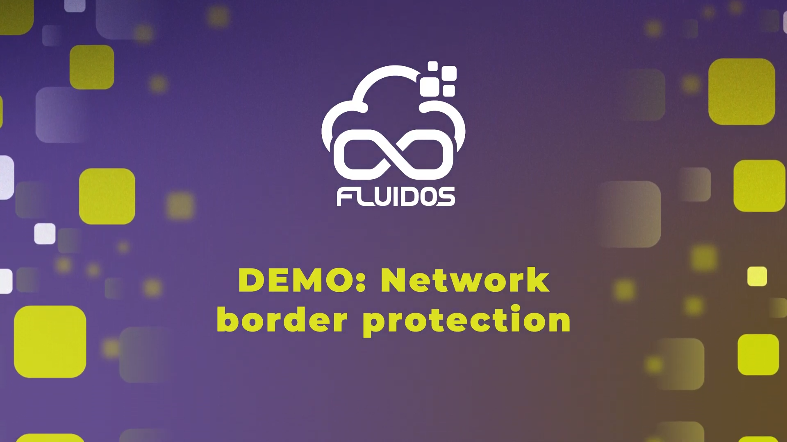

# Protected Borders – Demo Guide
## Watch the Demo:

<p align="center">
  <a href="https://www.youtube.com/watch?v=7NBoORvkJ5U&t=34s" target="_blank">
    
  </a>
</p>

--- 


This document provides a guided walkthrough of the demo workflow showcasing the **Secure Border Controller**.

---

## Demo Setup – Step-by-Step
### Prerequisites: 

The demo requires an installation of the [FLUIDOS Node](https://github.com/fluidos-project/node) with a supported CNI. At the moment, only **Calico** is supported. Please refer to the FLUIDOS Node documentation for base setup instructions.

In this demo, it will be used the same testbed with KinD which is used in the FLUIDOS Node repository. However, to enable Calico in the testbed environment, several files in the official FLUIDOS Node repository must be created or replaced with customized versions provided in this repository.

| File to Replace                                              | Custom Version                                |
| ------------------------------------------------------------ | --------------------------------------------- |
| `node/tools/scripts/setup.sh`                                | `demo/resources/setup.sh`                     |
| `node/tools/scripts/environment.sh`                          | `demo/resources/environment.sh`               |
| `node/quickstart/kind/configs/standard.yaml`                         | `demo/resources/calico.yaml`                  |
| *(new)* `node/quickstart/utils/calico-custom-resources.yaml` | `demo/resources/calico-custom-resources.yaml` |
| *(new)* `node/quickstart/utils/tigera-operator.yaml` | `demo/resources/tigera-operator.yaml` |

Before moving on, follow these steps:
- Clone the [FLUIDOS Node](https://github.com/fluidos-project/node) repository and optionally backup the original files.
- Copy the customized files from this repository to the corresponding locations in the FLUIDOS Node repository.
```bash
cd node
cp <PATH_TO_SBC_REPO>/demo/resources/setup.sh tools/scripts/setup.sh
cp <PATH_TO_SBC_REPO>/demo/resources/environment.sh tools/scripts/environment.sh
cp <PATH_TO_SBC_REPO>/demo/resources/calico.yaml quickstart/kind/configs/calico.yaml
cp <PATH_TO_SBC_REPO>/demo/resources/calico-custom-resources.yaml quickstart/utils/calico-custom-resources.yaml
cp <PATH_TO_SBC_REPO>/demo/resources/tigera-operator.yaml quickstart/utils/tigera-operator.yaml
```
- Ensure that the `node/tools/scripts/setup.sh` script is executable:
```bash
chmod +x node/tools/scripts/setup.sh
```

Finally, make sure to have installed the `yq` tool, needed later during the demo
```bash 
sudo apt install yq
```
### 1️⃣ Setup the Environment

- Execute the environment setup script:
```bash

./tools/scripts/setup.sh
```
- Choose default settings (1, then confirm with y where prompted).
- This will deploy two KinD clusters: Consumer and Provider, with Calico installed.
- Next, move to the `demo` folder of this repository:
```bash
cd <PATH_TO_SBC_REPO>/demo
```

- Set the `KUBECONFIG` environment variable to point to the Consumer/Provider cluster config files. These are contained in the `node/tools/script` folder of the FLUIDOS Node repository.:
```bash
export KUBECONFIG=<PATH_TO_NODE_REPO>/tools/scripts/fluidos-consumer-1-config
```
> NOTE: to interact with the Provider cluster, set `KUBECONFIG` to `fluidos-provider-1-config`. Avoid repeating this command by opening a new terminal and setting the `KUBECONFIG` variable there.

### 2️⃣ Run Initial Setup Scripts

- From the `demo/` folder:

```bash
# On the Consumer cluster
./0_consumer_setup.sh

# On the Provider cluster
./1_provider_setup.sh
```
- These scripts:
  - Set up namespaces and pods both uin the Consumer and Provider clusters
  - Create the necessary Service Accounts
  - Deploy the controller
  - In the Provider, Flavors are updated by inserting the ```ip```, ```nodeId``` and ```providerId```. They are then applied with AuthorizationIntents data

### 3️⃣ Trigger the Peering Process

- Wait for the SBC to be running, this can be confirmed with the command:

```bash
kubectl get pods -n fluidos
```
- Apply the Solver CR on the Consumer cluster:

```bash
kubectl apply -f ./solver-custom.yaml
```
- After this command, REAR processed the request and the Provider's Flavor should have been received by the Consumer in the form of PeeringCandidate. Once this happen, the secure border controller starts a Verification phase to check the compatibility of the received Flavor with the requested one. 
- You can inspect the Solver CR using:
```bash
kubectl get solver -n fluidos
```
- The received PeeringCandidates can be seen with the following command:

```bash
kubectl get peeringcandidates -n fluidos
```

- Check controller logs to monitor the verification process:

```bash
kubectl get pods -n fluidos
kubectl logs <consumer-controller-pod> -n fluidos
```
> Wait ~20 seconds after applying the CR.

### 4️⃣  Reservation and Allocation
- Given the result of the verification, one of the received PeeringCandidate needs to be selected to proceed with the reservation and acquisition process.
- From the Consumer side:

```bash
./2_reservation_and_allocation.sh <peeringCandidate-name>
```

- The script:
  - Updates `reservation.yaml` with information from ConfigMaps (Consumer details) and PeeringCandidate (Provider details)
  - Applies Reservation and Allocation CRs

- You can inspect the Reservation CR to check the outcome of the reservation process using:
```bash
kubectl get reservation -n fluidos
```

### 5️⃣  Patch the Contract
- To pass the Consumer's Request intents to the Provider, the demo uses a Kubernetes ConfigMap that is automatically reflected on both clusters thanks to Liqo. 
- On the Provider cluster:

```bash
./3_patch_contract.sh
```

- This:
  - Identifies the relevant `Contract`
  - Injects the name of a shared ConfigMap
  - Creates the ConfigMap containing Request intents

### 6️⃣ Resource Offloading and Harmonization
- The Consumer offloads its resources on the peered cluster and the Secure Border Controller on the Provider will perform harmonization, translation and enforcement of the proper intens (starting from the Requested intents in the ConfigMap, and the Authorization intents of the selected Flavor).
- On the Consumer cluster:

```bash
./4_harmonize.sh
```

- Once the namespace is offloaded, the Provider’s controller will:
  - Read the `Contract`
  - Harmonize Request and Authorization intents
  - Translate them into Kubernetes Network Policies

- You can check logs of the secure border controller to verify Network Policies on the Provider:

```bash
kubectl logs <provider-controller-pod> -n fluidos
kubectl get networkpolicies -A
```
---

## Testing Network Policies

### 1️⃣ Access Pod Shell

```bash
kubectl exec -it <pod-name> -n <namespace> -- /bin/sh
```

### 2️⃣ Test a Connection

```bash
wget <destination-pod-ip>:<port>
```
---

## Cleanup
- To clean up the demo, run the script in the `tools/scripts` of the FLUIDOS Node repository:

```bash
cd node/tools/scripts/
./cleanup.sh
```

## Common Issues - Troubleshooting
1. Liqo installation times out and gets rolled back. This is usually cauysed  by some of the resources not starting correctly, and can be proven with the command:
```bash
kubectl get pods -A
```
If some pods show 'ImagePullBackOff' or 'CrashLoopBackOff', you can check the logs of the pod with:
```bash
kubectl logs <pod-name> -n <namespace>
```
- The most common issue is that the default image registry (docker.io) imposes a rate limit on the number of requests. To solve this, you can either:
  - Use a different image registry (e.g., ghcr.io)
  - Use a local image registry
  - Use a private image registry
The following guide provides instruction on how to configure calico to use a different image registry:
https://docs.tigera.io/calico/latest/operations/image-options/alternate-registry

2. The `setup.sh` script fails silently upon KIND cluster creation.  Indeed, this setup relies on KIND (Kubernetes in Docker) to quickly establish a reliable testbed for testing the FLUIDOS Node architecture.

There are common issues encountered when running multiple clusters with KIND, particularly related to swap space memory usage and resource limits within the operating systems.

Therefore, it is highly recommended to run the following commands before proceeding with the installation process:

```bash
sudo swapoff -a
sudo sysctl fs.inotify.max_user_instances=512
sudo sysctl fs.inotify.max_user_watches=524288
```

